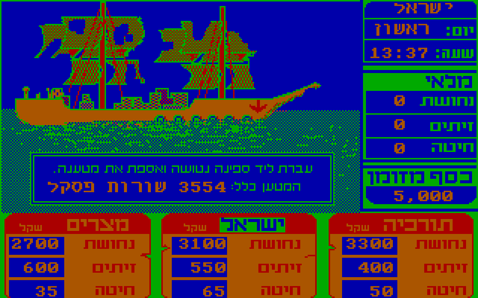
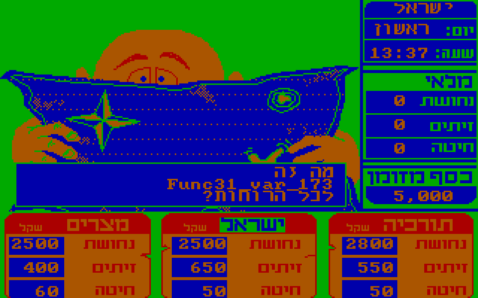

# Matching decompilation of [Socher Hayam (סוחר הים)](https://he.wikipedia.org/wiki/%D7%A1%D7%95%D7%97%D7%A8_%D7%94%D7%99%D7%9D_(%D7%9E%D7%A9%D7%97%D7%A7_%D7%9E%D7%97%D7%A9%D7%91))



The good news is that we have a matching decompilation of the game סוחר הים - source code that compiles to the exact same binary as the original.

The bad news is that this decompilation was done in an automated fashion, so all functions, procedures, variables and types have silly names such as `Func31`, `Func35_var_86` and `arr_record_13866380471399314824_11`.

The goal of this project is to rename all of this nonsense into descriptive names and to document/annotate the source code as necessary, while preserving the resulting binary.

## Why?

Socher Hayam is a cult classic and a wonderful educational game, which deserves appreciation and preservation.

Reconstructing the source will allow a better understanding of it and the creation of modern ports (pun definitely intended), true to the original.

## Contributing



Please feel free to make pull requests for renaming variables or functions, simplifying expressions, adding documentation, etc.

My personal recommendation is not to use AI, since that's not very fun, but do whatever you enjoy, as long as the results are high quality.

When renaming identifiers, please drop the snake_case and use PascalCase instead.

## Requirements

* Python
* DOS emulator, such as [DOSBox](https://www.dosbox.com/) or [dosemu2](https://dosemu2.github.io/dosemu2/)

## Building

First run the script:
```
./build/reencode.py
```

Then in your DOS emulator, from within the `build` folder, run:
```
compile
```

Afterwards you should see a new `k.com` file in the `build` folder.

## Validation

In order to make sure the compiled file still matches the original executable, run the script:
```
./build/validate.py
```

## Files Overview
```
├── GLOBALS.PAS         # Globals and type declarations
├── CODE.PAS            # Rest of the code
├── build
│   ├── reencode.py     # Script for reencoding the files from the
│   │                     parent folder from UTF-8 to CP862
│   ├── compile.bat     # Command for compiling the code
│   ├── validate.py     # Script for validating a compiled file matches
│   │                     Socher Hayam
│   ├── K.PAS           # Input file for compilation, includes the
│   │                     reencoded files
│   ├── TPCLI.COM       # Patched version of Turbo Pascal 3.01A which
│   │                     can be used from the command line
│   ├── GRAPH.P         # Header part of Turbo Pascal's graphics lib
│   └── GRAPH.BIN       # Binary part of Turbo Pascal's graphics lib
└────── Readme.md       # This file
```

The annotation work is expected to be done exclusively in `GLOBALS.PAS` and `CODE.PAS`, while the contents of the `build` directory is only there for compilation and validation.

You can recreate the CLI version of Turbo Pascal by using the [dissassembly tools](https://www.pcengines.ch/tp3.htm) and applying [this patch](https://gist.github.com/ashdnazg/ce73d2618eeaf068f57ac1bc60889de7).

## FAQ

### What is This Reencoding Step?
The original code used [Code page 862](https://en.wikipedia.org/wiki/Code_page_862) for representing Hebrew characters. For ease of editing, this repository contains the code encoded using UTF-8. This means a reencoding step is required before compilation, which is handled by the `build/reencode.py` script.

### Why are Some Bytes Ignored in the Validation?
There are two segments of bytes in the compiled executable which don't match the original. Both, however, don't really depend on the source code:
1. Timing measurements - During the startup of Turbo Pascal 3.0 or any program compiled by it, there's initialization code that measures how many cycles the CPU runs in a second, to be used later in `Delay` calls. So this value in the executable both depends on the compilation machine _and_ is recalculated anyway when you start up the executable.
2. Uncrunch stuff - This is only relevant for [overlays](https://en.wikipedia.org/wiki/Overlay_(programming)) which Socher Hayam doesn't use, so it's irrelevant for us.
